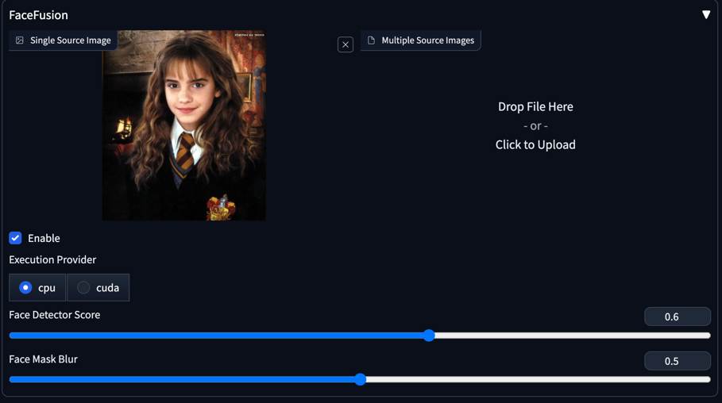

# FaceFuison extension for StableDiffusion Webui

[FaceFusion](https://github.com/facefusion/facefusion) is a very nice face swapper and enhancer.

This repo makes it an extension of [AUTOMATIC1111 Webui](https://github.com/AUTOMATIC1111/stable-diffusion-webui/).



## Installation

-   Clone this repo into `stable-diffusion-webui/extensions` folder.
-   Start the Webui.

## SD webui alwayson_scripts api

```python
alwayson_scripts = {
	"facefusion": {
		"args": [
			# face image
			get_base64_image('./t1.png'),
			# Enable
			True,
			# Execution Provider
			"cuda",
			# Face Detector Score
			0.6,
			# Face Mask Blur
			0.7,
			# Batch Sources Images
			[get_base64_image('./t2.png'), get_base64_image('./t3.png')]
		]
	}
}
```
